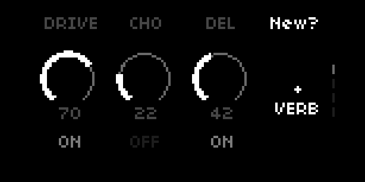
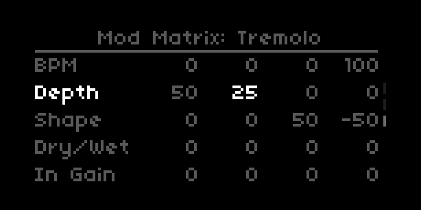
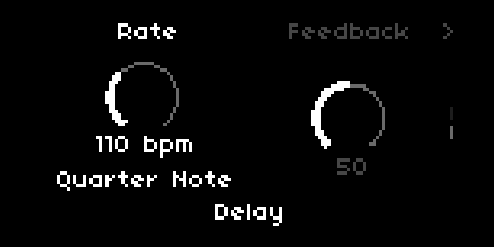

# Pedalboard
A simple collection of chainable effects for the Norns sound computer.

## Pedals
* Delay
* Reverb
* Overdrive
* Chorus
* Tremolo
* Distortion
* Flanger
* Phaser
* Compressor
* Sustain
* Bitcrusher
* Wavefolder
* Ring Modulator
* Pitch Shifter
* Sub Boost
* Vibrato
* Auto-Wah
* Lo-Fi
* Resonator, based on Mutable Instruments Rings
* Granular, based on Mutable Instruments Clouds
* Amp Simulator
* Equalizer
* Tuner
* More to come in future versions! File a GitHub issue with recommendations, or join the discussion at [Lines](https://llllllll.co/t/pedalboard-chainable-fx-for-norns/31119/27)

## UI & Controls
* E1 always changes page

### Page 1: Board

* Left-to-right list of slots for pedals
* E2 changes focused slot
* E3 changes pedal in focused slot (including "no pedal")
* E3 doesn't take effect til K3 confirms
* Last slot is always "add new" (using K3 to confirm)
* K2 jumps to pedal page
* K2 + E2 re-orders pedals
* K2 + E3 changes wet/dry for focused pedal
* K2 + K3 toggles bypass for focused pedal
* K2 + K3 when adding or changing a pedal puts the new pedal in bypass by default

### Last Page: Mod Matrix

* First few sections are high-level controls for the Envelope Follower and 3 LFOs
* After that, there's a "mod matrix" section, where each modulator can control the active pedals' settings
  * Left 3 columns are the 3 LFOs, then the right-most column is the Envelope Follower
* E2 scrolls through the rows
* E3 changes the focused value
* K2 moves left, K3 moves right (when in the "mod matrix" section)

### Other Pages: the Pedals

* UI is custom per pedal, but typically shows a dial or two at a time, controlled by E2 & E3
* Each pedal has dials specific to its effect
* K2 cycles left thru dial pairs, moving left a section or looping at the left edge
* K3 cycles right thru dial pairs, moving right a section or looping at the right edge
* Every pedal has the following dials as its last 4:
  * Bypass
  * Wet/dry
  * In gain
  * Out gain
* On pedals with tap-tempo (currently Delay and Tremolo), hold K2 and tap K3 for tap tempo

## Requirements
* norns (200328 or later)
* Audio in (stereo preferred, mono mode available in params)
* Reset after installs or updates (this is a new Engine)

## Roadmap
Film a brief demo video showing how it works

### More Pedals!
* Freezer/Looper
* Stutter

### Better Pedals!
* Multi-tap and Varispeed delays
* Spring and Plate reverbs
* EQ shelves can be filters instead, and an additional peak EQ
* Continued iteration on how the dials alter the effect
  * Covering musical ranges with multiple sweet spots, while also offering interesting extremes

### A System of Simple and Fine Control
* Pedals should be able to have more parameters, beyond the meta-controls in their main UI
* This could live either in the menu only, or as the last section to the right of a pedal
* Each meta-control is really a combo of fine settings. If fine settings don't line up with where knob says it is, then they move by more than the knob moves until they catch up (and thereafter behave normally)

### Marking a PSet as default
* Would be nice to have some pedals in place right when you launch, if you use them that often
* Or even: it's just right where you left it (auto-save)
